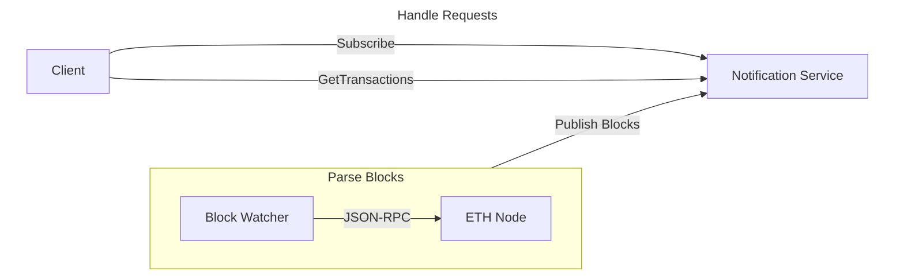

# Architecture

The project is built as a single service that has two major components:
- The Ethereum block watcher: `domain/watcher.go`.
- The notifications service: `domain/service.go`.

### ETH Block Watcher

The watcher connects to an Ethereum node and requests newly-produced blocks. It then "publishes" those blocks and they eventually reach the notifications service. It talks to the Ethereum node via its JSON-RPC API using our own client library in `client/eth`.

### Notifications Service

The service processes transactions in the blocks it receives, keeps track of subscriptions and returns transactions for an address we have subscribed to.

### HTTP API

The service is exposed to the outside world via an HTTP API that is implemented by `http/server.go` and `http/routes.go`

## Deployment

The service can be deployed to any container runtime. We have a working Docker image builder that can be extended with a Helm chart.

Configuration is done via environment variables, [12-factor style](https://12factor.net/config). See `config/config.go` for the full list. Those have been kept to the bare minimum like the ETH node endpoint.

## Scalability

The service uses only in-memory data to store transactions and subscriptions. To make it real, we need some real persistence:

- The `TransactionStore` type in `service.go` can be replaced with an SQL-backed database store that can store all blocks and associated transactions. With the proper indexes in place we wouldn't need to maintain subscribed addresses in memory and we could return transactions for any given address.
- The `/transactions` endpoint returns all transactions. That should be extended to support paging or allow additional filters that restrict the resulting dataset.
- I would extend the notifications service to make it parse transactions for subscribed addresses and publish them on a notification stream. That would allow a separate service to consume them and route them to an email send service or a push notification publisher. We can even have a websocket gateway that can push to web clients' browsers.

## Security

- The service is meant to be deployed in a private network. Ideally it should be accessible only to the local k8s cluster/namespace.

## Testing

- I have added unit tests for the individual components. Coverage is not at 100%, but we could easily get there. Looking at the coverage report we are missing mostly error handling and logging branches that should be easy to test.
- Some of the tests are more integration-style -- the ETH client spings up a HTTP server that simulates the ETH node JSON-RPC API.
- E2E tests should be possible. I took a quick look at running a single ETH node with a local testnet and it doesn't seem to hard to do it. We can spin up a node and publish transactions as a part of the E2E test.

## Monitoring and Logging

- Logging is implemented using the relatively new `log/slog` Go stdlib package. The root logger is created in `main.go` and propagated to downstream services, so we can easily change log configuration and say easily switch to JSON-based log lines.
- No tracing and monitoring has been implemented. I would hook that with HTTP middleware both for the HTTP API service and the ETH JSON-RPC client. I can see some opportunities for tracking additional metrics like the number of subscriptions, the number of blocks and transactions that we parse, etc.
- Speaking of tracking parsed blocks and transactions, once we have those metrics in place, we could add alerts for cases when they drop to zero. We can also alert on the usual metrics like increased error rates, increased latencies, etc.
